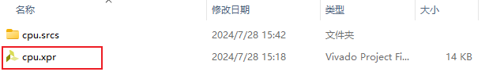
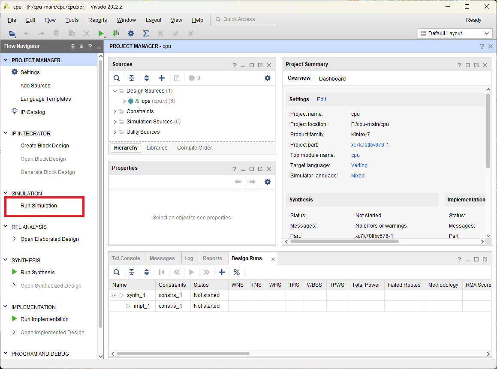
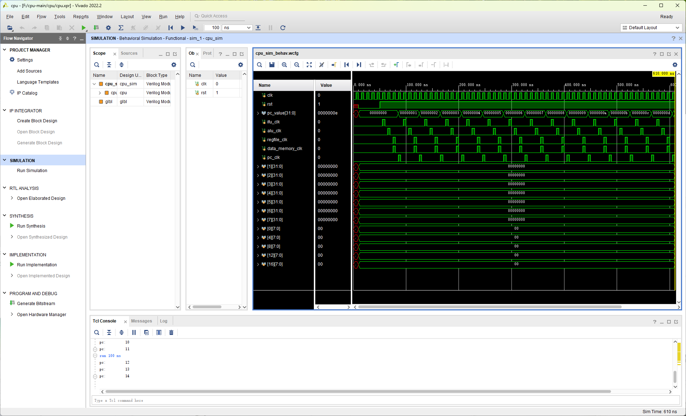
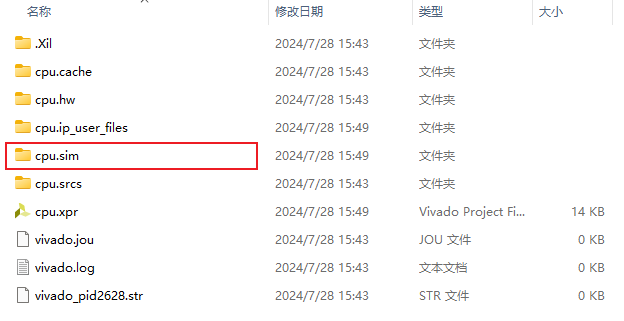
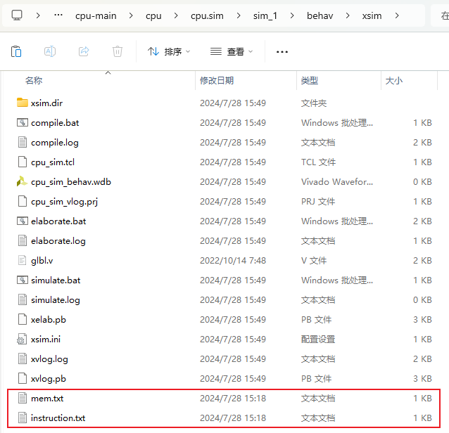
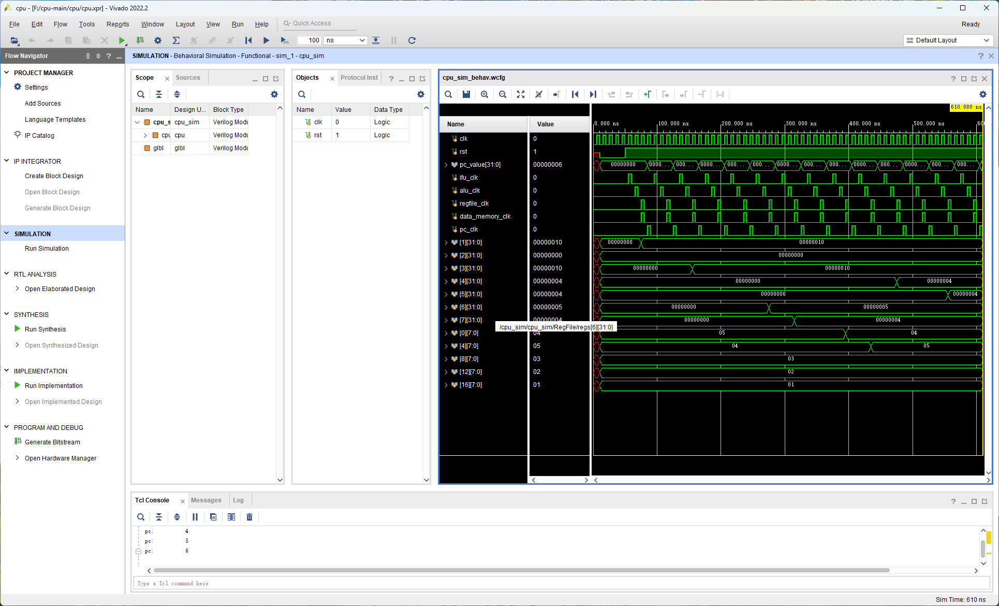
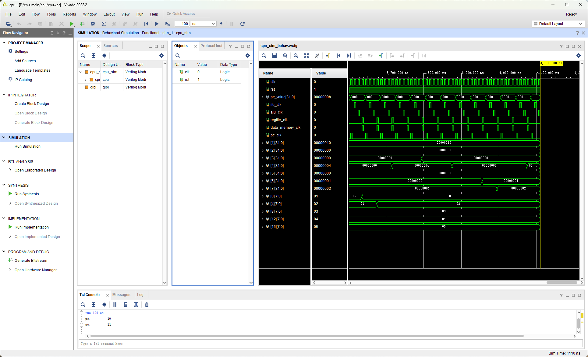

# CPU

使用Verilog编写的CPU，包括单周期CPU和流水线CPU。在实现的流水线CPU基础上，通过C语言进行外设的控制，实现了一个音乐播放器。

🔗[其他资源](https://github.com/wyt8/bit-cs)

## 🔍目录结构说明

* `ALU/`：算术逻辑单元，为了熟悉Verilog和Vivado的预备实验
  * `alu/`：Vivado项目目录，点击`alu.xpr`即可打开项目。
  * `实验报告/`：实验报告的Word版本

* `单周期CPU/`：单周期CPU，非流水线版本
  * `cpu/`：Vivado项目目录，点击`cpu.xpr`即可打开项目
  * `实验报告/`：实验报告的Word版本和用到的表格
  * `mem.txt`：数据内存存放的数据
  * `instruction.txt`：指令缓存存放的一系列指令的机器码
  * `sort.asm`：具有排序功能的汇编源代码
  * `实验单周期CPU任务书.pdf`：单周期CPU实验需求

* `计算机组成原理/`：流水线CPU
  * `vivado/pipeline_cpu/`：Vivado项目目录，点击`pipeline_cpu.xpr`即可打开项目
  * `测试汇编代码和机器码/`：测试用的汇编代码和机器码
  * `计算机组成原理实验报告.docx`：实验报告

* `汇编与接口/`：使用C语言编写的音乐播放器
  * `vivado/interface`：Vivado项目目录，点击`interface.xpr`即可打开项目
  * `vivado/data_mem.coe`：数据内存存放的数据
  * `vivado/inst_mem.coe`：指令内存存放的机器码
  * `C/`：音乐播放器的源码
  * `C语言环境搭建/`：使用C语言编写程序，生成riscv32汇编代码，最终生成机器码的步骤
  * `LCD显示屏基础教程/`：LCD显示屏外设的显示教程
  * `汇编与接口技术实验报告.docx`：实验报告
  * `计算机组成原理与接口设计汇报展示.pptx`：汇报PPT
  * `日志.xlsx`：实验过程中的日志

## ❗注意

1. 不要将Vivado项目放在含有*中文*的路径下，否则无法正常仿真。
2. 单周期CPU的指令编码并没有完全按照RISC-V指令集。
3. 本项目使用的Vivado版本为*2022.2*。

## 🛠️项目运行

对于单周期CPU实验，复现步骤如下：

1. 点击`单周期CPU/cpu/cpu.xpr`打开Vivado项目（注意把`cpu`目录移动到不含中文路径的目录下）

   

2. 运行一次仿真

   

   

3. 仿真运行成功后会在目录下生成目录`cpu.sim/`

   

4. 将`mem.txt`和`instruction.txt`复制到`cpu.sim/sim_1/behav/xsim`路径下

   

5. 再次运行仿真，即可应用指令缓存和数据内存中的内容，对数据进行排序

   

   
