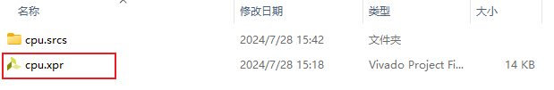
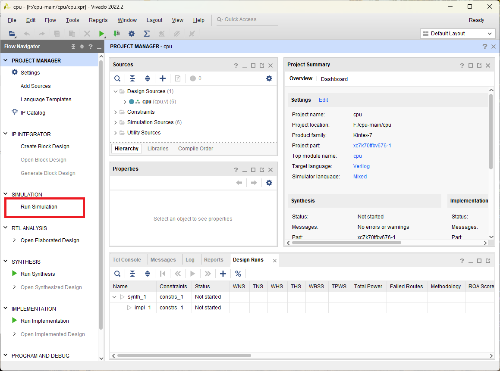
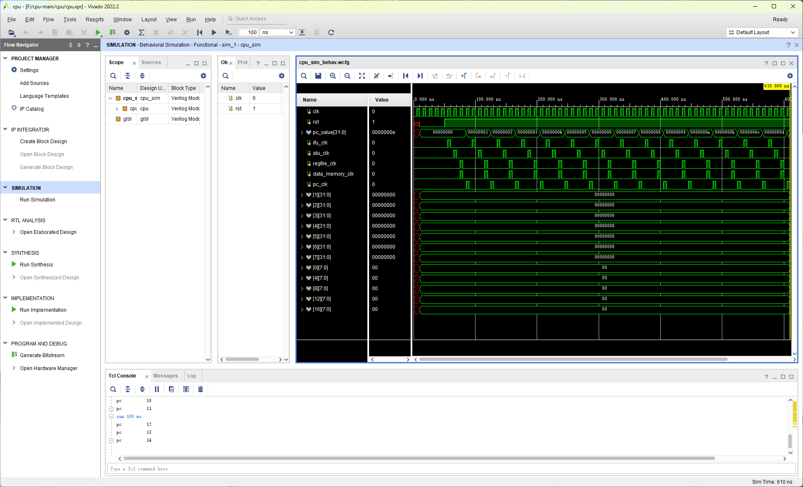
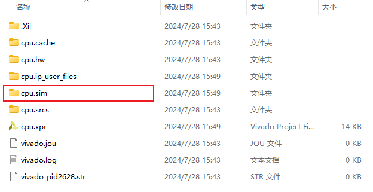
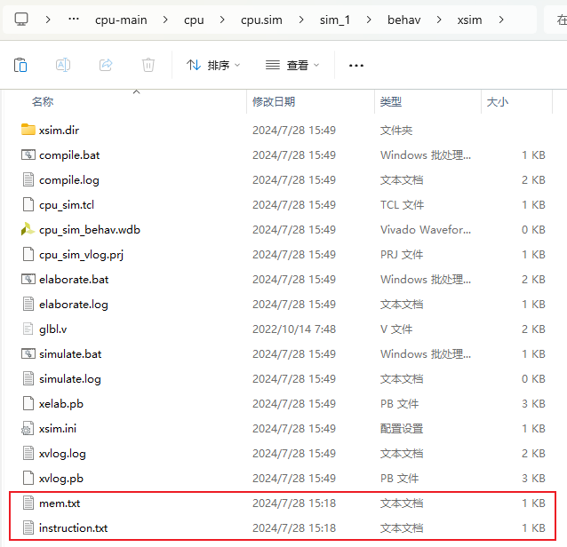
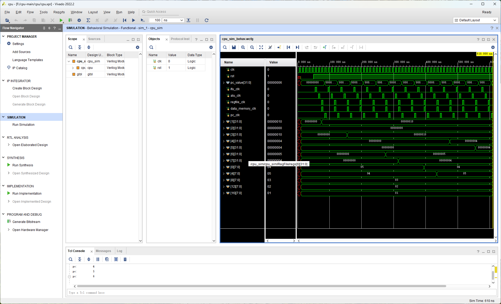
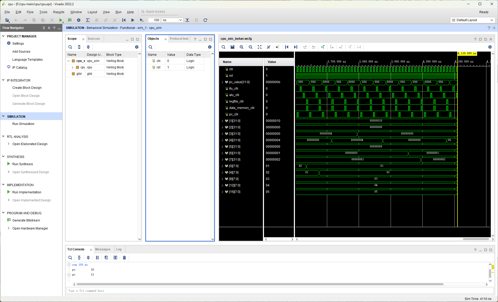

# CPU

使用Verilog编写的CPU

## 🔍目录结构说明

* `ALU/`：算术逻辑单元，为了熟悉Verilog和Vivado的预备实验
  * `alu/`：Vivado项目目录，点击`alu.xpr`即可打开项目。
  * `实验报告/`：实验报告的Word版本

* `单周期CPU/`：单周期CPU，非流水线版本
  * `cpu/`：Vivado项目目录，点击`cpu.xpr`即可打开项目
  * `实验报告/`：实验报告的Word版本和用到的表格
  * `mem.txt`：数据内存存放的数据
  * `instruction.txt`：指令缓存存放的一系列指令的机器码
  * `sort.asm`：具有排序功能的汇编源代码
  * `实验单周期CPU任务书.pdf`：单周期CPU实验需求

## ❗注意

==不要将Vivado项目放在含有*中文*的路径下==，否则无法正常仿真。

## 🛠️项目运行

对于单周期CPU实验，复现步骤如下：

1. 点击`单周期CPU/cpu/cpu.xpr`打开Vivado项目

   

2. 运行一次仿真

   

   

3. 仿真运行成功后会在目录下生成目录`cpu.sim/`

   

4. 将`mem.txt`和`instruction.txt`复制到`cpu.sim/sim_1/behav/xsim`路径下

   

5. 再次运行仿真，即可应用指令缓存和数据内存中的内容，对数据进行排序

   

   
