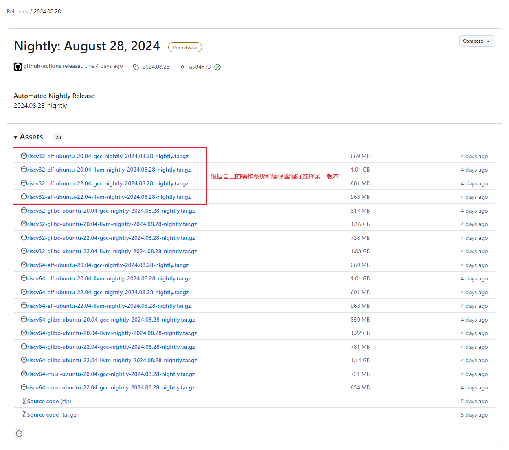
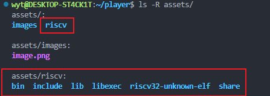
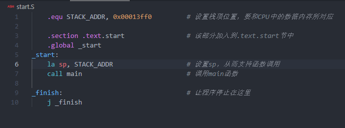
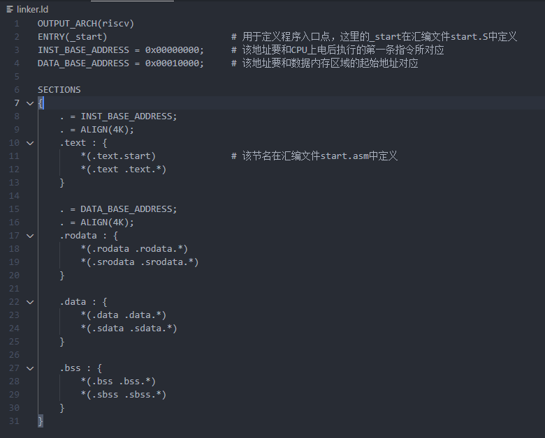
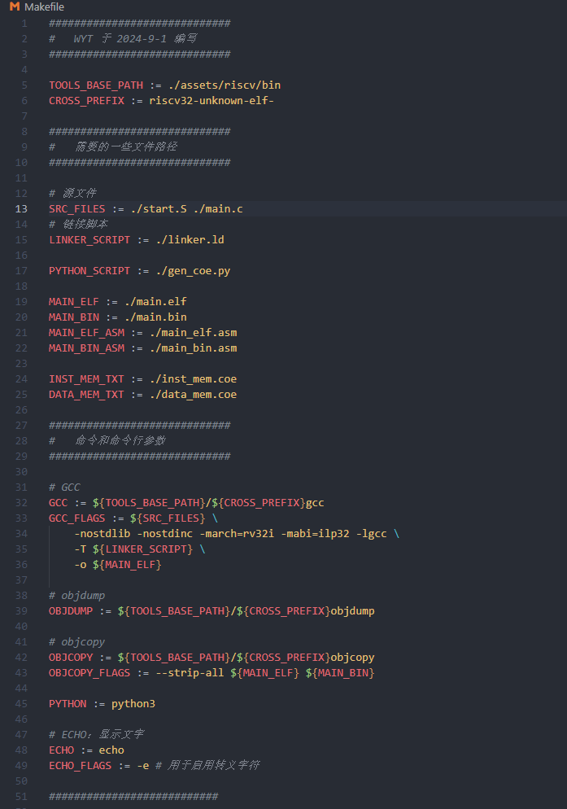
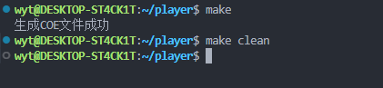

# C语言环境搭建

本教程的主要内容为：在实现`riscv32i`指令集中除操作控制状态寄存器指令、`ecall`、`ebreak`指令等共37条指令后，通过编写C语言来控制外设。

本教程的环境为Ubuntu22.04的Linux环境。

## 下载交叉编译工具

由于我们构建的CPU的指令集为`riscv32`，而我们自己电脑（宿主机）的CPU的指令集为`x86_64`或`ARM`等，默认情况下编译后生成的是和宿主机相同指令集的二进制文件，所以这里需要交叉编译工具。

可以从[官网](https://github.com/riscv-collab/riscv-gnu-toolchain)自行下载源码进行编译，也可以从该[链接](https://github.com/riscv-collab/riscv-gnu-toolchain/releases)直接下载已经编译好的二进制文件，这里直接使用已经编译好的二进制文件进行使用。

选择一个任意时间的发行版，然后选择某一版本进行下载。这里选择`riscv32-elf-ubuntu-22.04-gcc-nightly-2024.08.28-nightly.tar.gz`版本进行下载。它的文件名含义如下：

* `riscv32`：目标机的指令集为`riscv32`
* `elf`：没有标准的运行时库（表明没有任何系统调用的封装支持），但可以生成`ELF`格式的执行程序
* `gcc`：使用`gcc`编译器

为了减少修改Makefile文件的地方，我们解压后将其放置到`./assets`目录下。

## 设置栈来支持函数调用

这部分内容位于`start.S`中。栈一般位于内存的高地址部分，向低地址部分扩展。

代码的关键点如下：

1. 代码第1行声明常量：表示栈底位置为0x00013ff0，由于我们的CPU数据内存映射的地址范围为0x00010000~0x00014000，所以这里我设置了栈地址为0x00013ff0，这个地方**需要根据实际情况修改**。

2. 代码第3行表示之后的部分属于名为`.text.start`节中；代码第4行表示标号`_start`可以被其他文件可见。**这些内容会在后续的链接脚本中使用到**。

3. 代码第6行设置栈指针；代码第7行调用`main`函数，这个`main`函数对应C语言中的`main`函数，这里`main`可以更换为其他名字，但要与C语言中的入口函数相互对应。

4. 代码第10行的作用是防止`main`函数调用返回后继续执行非预期指令。

## 使用链接脚本调整程序布局

这部分内容位于`linker.ld`中。主要功能是描述如何将输入文件的节区映射到输出文件的节区中，同时对输出文件的存储布局进行控制。

脚本的关键点如下：

1. 脚本第1行指定输出代码的指令集架构为`riscv`。
2. 脚本第2行指定程序入口点为`_start`，与`start.S`中的`_start`标号所对应。
3. 脚本第3行和第4行定义常量，分别表示代码区（也就是`.text`部分）的起始位置和数据区（对应于`rodata`、`.data`、`.bss`部分）的起始位置，**这部分要根据自己的CPU设计进行相应调整**。
4. 脚本第11行表示名为`.text.start`位于代码区的最前面，与`start.S`中的节名所对应。
5. 其他部分感兴趣的可以自行查找资料来理解，这里就不再赘述。

## Makefile文件

为了方便操作，我编写了一个Makefile文件。在使用之前需要进行部分修改来使之正常运行。

1. 确保交叉编译工具链的可执行文件路径确实如第5行所示。
2. **当C语言源文件增加时，确保被第13行所包含**。
3. 第45行指定了python解释器的命令，需要根据自己电脑情况进行修改。
4. python需要安装`pyelftools`库：在命令行中输入`pip install pyelftools`进行安装。

在命令行中输入如下命令运行Makefile：

1. `make`：生成COE文件
2. `make clean`：清除生成的中间文件和COE文件

## 其他内容

1. 由于`riscv32i`指令集中不包含乘、除、余运算，所以需要通过编写循环函数来求解。
