# LCD基础教程

本教程的主要内容如下：LCD显示屏的显示原理、编程方法和显示给定图片的技巧。

如无特别说明：本文的文档指`JLX128128G-81202-PN中文说明书.pdf`，LCD指北京理工大学精工板上的型号为`JLX128128G-81202`的液晶屏。

## 预备知识

1. 这款LCD可以显示128×128的单色或4灰度图片

2. 引脚的功能介绍：

   1. **RS（Register Select）**：用于选择寄存器，1为数据寄存器，0为指令寄存器
   2. **RST（Reset）**：低电平复位
   3. **CS（Chip Select）**：低电平片选。当CS信号为低电平时，表示选中了特定的设备或芯片，可以进行数据传输或操作；当CS信号为高电平时，表示设备或芯片处于空闲状态，不进行数据传输
   4. **RD**：使能信号，在串行方式中不用
   5. **RW（Read Write）**：1为读数据，0为写数据，在串行方式中不用
   6. **D7 ~ D0（Data7 ~ Data0）**：在并行方式中表示一字节数据的高位到低位；在串行方式中**D7**用于传输数据，**D6**用于时钟信号，其他位不用

3. 串行SPI方式写入数据的时序要求

    文档中给出的时序要求如下：

    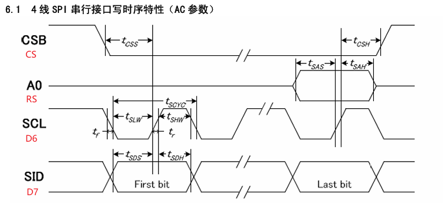

    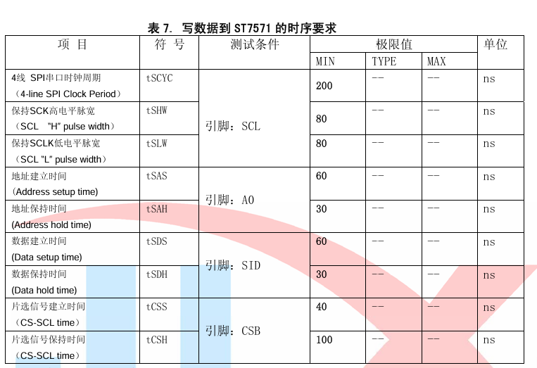

    关键点如下：

    1. 写入数据前要置`CS`为0，数据写完后要置`CS`为1
    2. 在传输数据的最后一位时必须要指定`RS`为1（写入的是数据）还是0（写入的是指令）
    3. 在传输数据的每一位（`D7`）时，需要保证时钟信号（`D6`）先为低电平后为高电平
    4. 具体时间要求要看表格中的极限值

    > 这部分是个人理解，不能保证完全正确。

4. page和column

    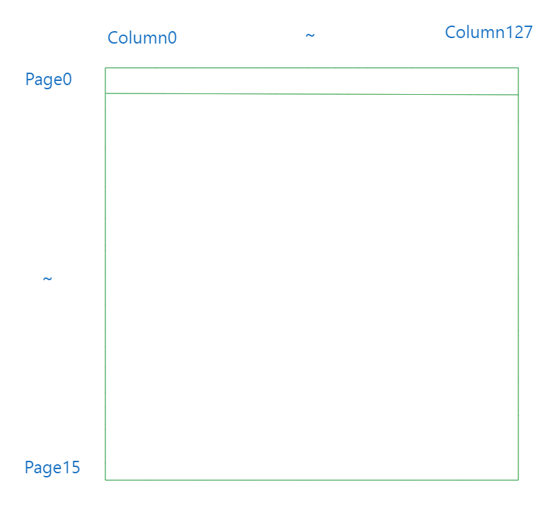

    page将LCD的128行分为16组，每组8行；column对应LCD的128列的每一列

    > 似乎LCD提供了指令可以调整LCD的扫描方向，所以图片上的排列方式不一定完全正确；不过本文中就是按照如图方式来进行初始化和显示图像的

5. 4灰度显示

    每个像素点需要2bit来决定显示的内容，00~11由白变黑，且黑色程度逐级增加

## 显示图像的主要过程

这部分主要参考文档第19~28页给出的程序。在实际测试过程中，当以并行方式操作LCD时，它不能显示图像。之后更换了以串行SPI方式操作LCD，结果显示正常。所以这部分主要讲解以**串行**方式让LCD显示图像。

1. 编写操作管脚的函数：置开发板中与LCD相关的管脚约束为1或0

    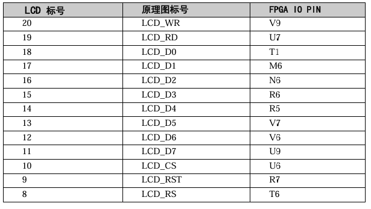

    * `SetWR()`：置`WR`为1
    * `ClearWR()`：置`WR`为0
    * `SetRD()`：置`RD`为1
    * `ClearRD()`：置`RD`为0
    * `SetCS()`：置`CS`为1
    * `ClearCS()`：置`CS`为0
    * `SetRST()`：置`RST`为1
    * `ClearRST()`：置`RST`为0
    * `SetRS()`：置`RS`为1
    * `ClearRS()`：置`RS`为0
    * `WriteLcdData(uchar data)`：根据data由高位到低位置`D7`~`D0`为1或0

2. 编写向LCD传送数据和命令的函数：按照文档27页要求编写函数

    ```c
    // 向 LCD 传送命令
    // 串行版
    void TransferCommandToLcd(uchar command) {
        ClearCS();ClearRS();
        for(int i = 0; i < 8; i++) {
            if(command & 0x80) {
                WriteLcdData(0b10111111);
                // SleepUs(1);
                WriteLcdData(0b11111111);
            }
            else {  
                WriteLcdData(0b00111111);
                // SleepUs(1);
                WriteLcdData(0b01111111);
            }
            // SleepUs(1);
            command <<= 1;
        }
        SetCS();
    }

    // 向 LCD 传送数据
    // 串行版
    void TransferDataToLcd(unsigned char data) {
        ClearCS();SetRS();
        for(int i = 0; i < 8; i++) {
            if(data & 0x80) {
                WriteLcdData(0b10111111);
                // SleepUs(1);
                WriteLcdData(0b11111111);
            }
            else {  
                WriteLcdData(0b00111111);
                // SleepUs(1);
                WriteLcdData(0b01111111);
            }
            // SleepUs(1);
            data <<= 1;
        }
        SetCS();
    }
    ```

    > 这里解释一下各个语句的含义：
    > 1. `ClearCS()`置片选信号为0，表示开始进行数据或指令传输
    > 2. `ClearRS()`和`SetRS()`分别表示向指令寄存器和向数据寄存器写入数据
    > 3. 之后的for循环表示将要传送的数据或指令从高位到低位逐个传送，并保证时钟先为低电平，后为高电平。以数据`0b10111111`为例：最高位的1表示要传输的数据为1，接着的0表示时钟为低电平，剩余6位在串行方式中不会用到，可随意设置
    > 4. 最后调用`SetCS()`表示数据或指令传输完毕
    > 5. 文档中要求传输数据时的时钟高电平与低电平需要至少持续一段时间，所以代码在最开始调用了`SleepUs(1)`休眠一微秒。或许由于我们的CPU时钟周期为40ns和插入气泡等因素，我发现不调用该函数LCD也可以正常工作，大家可以根据自己情况是决定是否需要休眠

3. 初始化LCD：该过程必须在让LCD显示图像前调用

    ```c
    // 初始化 Lcd，在使用前必须调用
    void InitLcd() {
        // 复位，rst保持低电平最少 2us
        ClearRST();
        SleepUs(500);
        SetRST();
        SleepUs(100);
        // 电源控制
        TransferCommandToLcd(0x2c);
        SleepUs(200);
        TransferCommandToLcd(0x2e);
        SleepUs(200);
        TransferCommandToLcd(0x2f);
        SleepUs(10);

        TransferCommandToLcd(0xae); // 显示关
        TransferCommandToLcd(0x38); // 模式设置
        TransferCommandToLcd(0xb8); // 85 Hz
        TransferCommandToLcd(0xc8); // 行扫描顺序
        TransferCommandToLcd(0xa0); // 列扫描顺序

        TransferCommandToLcd(0x44); // Set initial COMO register
        TransferCommandToLcd(0x00);
        TransferCommandToLcd(0x40); // Set initial display line register
        TransferCommandToLcd(0x00);

        TransferCommandToLcd(0xab);
        TransferCommandToLcd(0x67);
        TransferCommandToLcd(0x26); // 粗调对比度的值，可设置范围 0x20 ~ 0x27
        TransferCommandToLcd(0x81); // 微调对比度
        TransferCommandToLcd(0x36); // 微调对比度的值，可设置范围 0x00 ~ 0x3f

        TransferCommandToLcd(0x54); //  1/9 bias
        TransferCommandToLcd(0xf3);
        TransferCommandToLcd(0x04);
        TransferCommandToLcd(0x93);

        // TransferCommandToLcd(0x7b); // 扩展指令集 3
        // TransferCommandToLcd(0x11); // Gray mode
        // TransferCommandToLcd(0x10); // Gray mode
        // TransferCommandToLcd(0x00);
        TransferCommandToLcd(0xaf); // 显示开
    }
    ```

    > 这里调用`TransferCommandToLcd()`函数向LCD传送了一系列指令，如果对每条指令的含义有兴趣，可自行查阅文档的第13~15页

4. 定位LCD要操作屏幕的位置

    ```c
    // 设置 LCD 要操作的地址
    // page 的值从 0 ~ 15，colum的值从 0 ~ 127
    void SetLcdAddress(int page, int column) {
        ClearCS();
        TransferCommandToLcd(0xb0 + page);
        TransferCommandToLcd(((column >> 4) & 0x0f) + 0x10);
        TransferCommandToLcd(column & 0x0f);
    }
    ```

    > 这个过程涉及到的指令如下：
    > 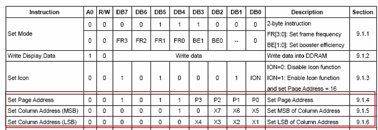

5. **向LCD传送数据来显示图像**

    ```c
    // 显示图像
    void ShowImageOnLcd(unsigned char* image) {
        for(int page = 0; page < 16; page++) {
            SetLcdAddress(page, 0);
            for(int column = 0; column < 128; column++) {
                TransferDataToLcd(image[page * 128 + column]);
                TransferDataToLcd(image[page * 128 + column]);
            }
        }
    }
    ```

    这里需要解释一下这个函数的含义：

    1. 该函数的主体是一个双层循环，在外层循环的开始调用`SetLcdAddress()`函数来定位显示位置

    2. 内层循环每列调用了两次`TransferDataToLcd()`函数来向LCD传输数据，具体每位的对应关系可以参考下图

        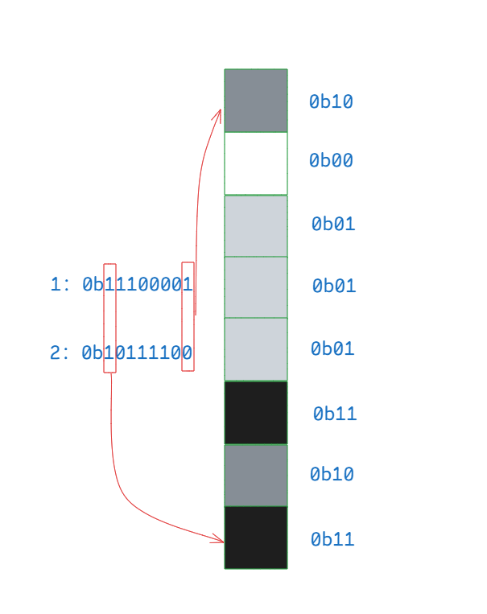

    3. 通过每列两次调用`TransferDataToLcd()`传送相同的内容可以达到显示单色图像的效果

## 生成图像数据

### 单色图像

这里介绍一款软件**Image2Lcd**，这款软件输入图片后可以获得C语言数组形式的图像数据。

按照图中的配置设置软件，就可以得到可以使LCD正确显示的单色图像数据。

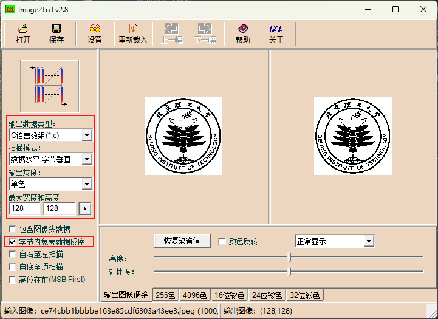

点击**保存**就可以得到C语言数组形式的图像数据，将数组名传递给上面提到的`ShowImageOnLcd()`函数即可显示单色图像。

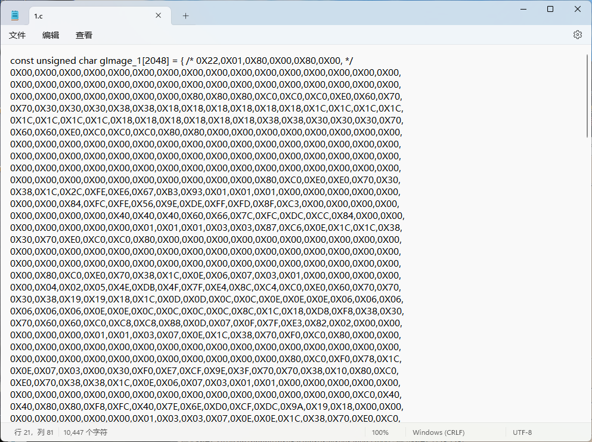

### 4灰度图像

这里我们接着使用**Image2Lcd**软件来生成4灰度图像。

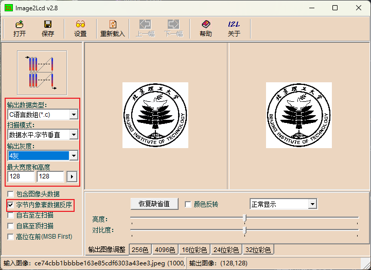

但是该软件生成的C语言数组形式并不能被我们直接使用，**因为它的格式和我们要求的格式不同**，所以这里我编写了一个脚本来进行转换。

该脚本名为`gen_4_grey.ipynb`，接下来我介绍一下该脚本的使用方法：

1. 将软件生成的4灰度图像的C语言数组元素内容贴到`text`变量中，注意要删除最后一个“,”，否则脚本无法正常工作。

    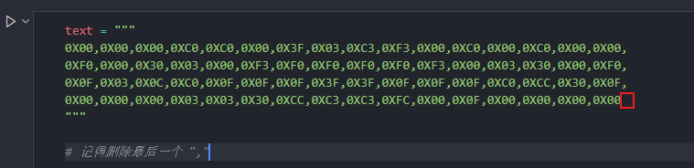

2. 指定图像的高度和宽度，要和`text`所对应。

    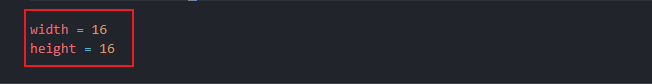

3. 运行整个脚本，可以在最后得到转换后的C语言数组元素内容。

    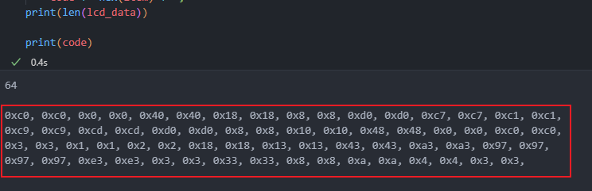

生成后我们可以调用如下函数来显示4灰度图像：

```c
// 显示4灰度图像
void ShowGreyImageOnLcd(unsigned char* image) {
    for(int page = 0; page < 16; page++) {
        SetLcdAddress(page, 0);
        for(int column = 0; column < 128; column++) {
            TransferDataToLcd(image[page * 128 + column]);
            TransferDataToLcd(image[page * 128 + column + 1]);
        }
    }
}
```

## 其他

1. 缩小图像数据大小：从上面可以看到，显示一张128×128的单色图像需要2KB，显示一张128×128的4灰度图像需要4KB。我们可以将屏幕化划分为不变部分和可变部分，每次只修改可变部分，同时可变部分可以区分单色区域和4灰度区域，这样可以显著减少图像占据的空间

2. 文字：LCD提供了显示文字的功能，但是我没有使用LCD提供的显示文字功能，而是使用图像来显示文字，这样更方便我们排版
